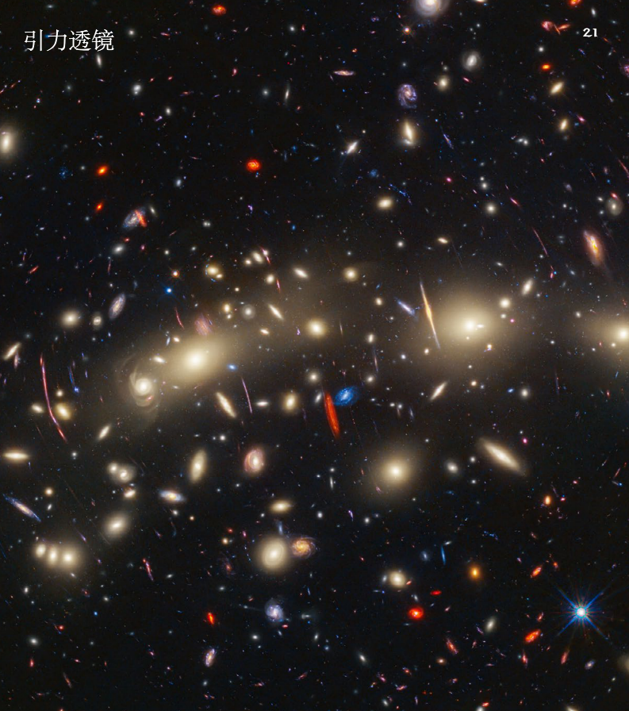

## 附录

### 真空能

* 真空能（即所谓开放空间的“零点能”之实例）是暗能量的候选源。在游戏中，异域星上的魔法角色利用真空能，为其穿越宇宙所用之魔法提供能量。角色们同地球一般，对真空能知之甚少，此便引致研究人员试图联系地球，以求对真空能知晓见长。

* 言及暗能量，未知之处远远大于已知。人们仅能借由暗能量对宇宙膨胀的影响来窥其多少，除此之外一无所知，但这种一无所知仍旧重要。事实证明，宇宙中大约68%是暗能量，暗物质约占27%，剩余的部分，即地球上的一切、人类仪器所能观及的一切以及所有普通物质，合计不足宇宙总体的5%。仔细想来，普通物质并不“普通”，其在宇宙中甚至更显稀缺。

* 有观点认为暗能量是空间的属性之一。阿尔伯特·爱因斯坦最先意识到真空区域并非虚无，而是具有空间自身的属性。他发现额外空间的存在得以成立，并由此推断“真空区域”可以拥有自己的能量（亦称“真空能”）。由于此能量作为空间本身的属性，所以其不会随空间膨胀而减弱。更多空间的出现便意味着更多额外的空间能量，因此宇宙的膨胀将愈发迅速。

* 空间获取能量的另一解释进路来自物质的量子理论。这一理论认为，所谓的“真空区域”事实上充斥着临时性的（“虚拟的”）粒子，这些粒子处在不断形成与消失的状态中。但当物理学家试图计算这一理论为真空区域带来的能量量级时，结果则错得荒诞。能量的数值来到了10的120次方，也就是在1后面写下120个0！

* 暗能量的另类可能解释，则是将其视作一类新型动态能量流或场域。它充斥在整个空间，不同于正常的物质与能量，其对宇宙膨胀造成影响。一些理论学家称其为“宇髓”，词本意取自希腊哲学家提出的第五元素。如果宇髓就是一切的答案，关于它何样、何动、何用以及何存，人们都知之甚少。

* 最后的可能性将我们引向对爱因斯坦引力理论的怀疑，这一理论可能本是谬误，或尚有缺陷。此样看法则要求新引力理论的出现或对旧理论进行修正，而任何变动都将为我们对宇宙膨胀及正常物质表现的理解带来影响。通过研究星系集群的生成方式，我们能检验诸新理论中谁能解决暗能量问题。

* 如若我们需要这样一种新理论，那么它如何既能如爱因斯坦的理论正确描述太阳系中物体的运动，同时又能描述暗能量在宇宙中的作用呢？当下理论确有候选，但尚不完备，所以这仍是一个谜。无论是空间属性、动态流或是新引力理论，我们仍需更多数据来助力解决暗能量之谜。

* 这张1E 0657-556星系团（即“子弹星系团”）的合成图像，采用哈勃望远镜与地基小麦哲伦望远镜的可见光数据以及NASA钱德拉天文台的X射线数据结合而成。X射线图像显示出两团粉红色的热气体，其内大部分由“普通”物质组成；蓝色区域则借由分析引力透镜效应确定存在着绝大部分质量。大部分物质（蓝色部分）显然与普通物质（红色部分）分离，这直接证明了子弹星系团中几乎所有物质都为暗物质。
* X射线数据：NASA/CXC/M·马克维奇等；
* 光学数据：NASA/STScI；
* 麦哲伦望远镜/U·亚利桑那/D·克洛等；
* 透镜效应图：NASA/STScI；
* 欧洲南方天文台广域成像仪；麦哲伦望远镜/U·亚利桑那/D·克洛等

### 引力透镜

* 若某一大质量天体（如黑洞）或天体集群（如星团）将时空扭曲至足以弯曲、放大与增强自远处天体而来之光线时，我们便认为发生了引力透镜效应，其间致使光弯曲的质量，即被称为引力透镜。

* 由于引力透镜能放大遥远天体的光线，哈勃望远镜同其他天文台常借其发现与研究先前因过暗或过远而未被探测的目标。天文学家借助引力透镜，已观测到迄今为止最为遥远的单体恒星、超新星与诸星系。

* 得益于自身的高分辨率与极高灵敏度，哈勃望远镜能观测到经由引力透镜放大并点亮的遥远暗淡物体。地面天文台则受限于浑浊大气带来的观测干扰，无法观测部分物体，这便是哈勃望远镜被置于地球近地轨道的其中一因。

* 在此游戏中，首席研究官给予玩家的透镜能凭借魔法创造出引力透镜的效果，令玩家能看得更远或察觉陷阱。魔法会在透镜周围创造出一个扭曲场域，以模拟大型天体扭曲时空的效果。

### 爱因斯坦环

* 环绕着SDSS J1038+4849星系团的爱因斯坦环使该星系团看上去像是在微笑当遥远光源、强大的引力透镜与观察者完全对准时，便会形成爱因斯坦环。光源对称着围绕引力透镜弯曲，形成环状结构。
* NASA，ESA，迈克尔·格莱德斯（芝加哥大学）
* 致谢：朱迪·施密特

* GAL-CLUS-022058s被戏称为“熔戒”，是我们宇宙中最大且最完整的爱因斯坦环之一。
* NASA，ESA，阿纳斯塔西奥·迪亚兹·桑切斯（西班牙卡塔赫纳理工大学），萨乌拉博·杰哈（格罗斯大学，新泽西州立大学）；
* 致谢：里奥·纳茨

* 宇宙马蹄铁是一个遥远的星系，该星系在其中心大质量前景发光红星系的强大引力作用下被放大和扭曲了。这个星系的质量大约是我们银河系的十倍。本图包括哈勃3号广角相机拍摄的可见光和红外光图像。

### 红移与蓝移

* 恒星与星系等物体日常保持正常大小，而宇宙膨胀导致物体间的空间增加，则使得诸物体似乎在相互远离，此将进一步导致观察者与光源间的光波有所延展。这样的退行运动导致光的波长增加，使其向光谱的红端移动，天文学家则称此为“红移”。

* 退行速度同距离成正比，所以诸如宇宙早期形成的较遥远物体，则会以更快的速度远离。极度遥远的物体所发出的可见光则可能会红移成人眼无法看见的更长波长的红色，即红外光。由此说明我们为何要在寻找最遥远或最早形成的星系时，使用对红外光更为敏感的望远镜与探测器。

* 放眼近身的“本地宇宙”，在此空间膨胀速度相对较慢，从观察者的视角来看，是恒星与星系缓慢且独立的运动，决定了物体相互远离并延长光波（红移），或是相互靠近并压缩光波（蓝移）。

### 哈勃望远镜

玩家在办公室调查找到望远镜图纸

哈勃眼中的宇宙

哈勃控制中心

